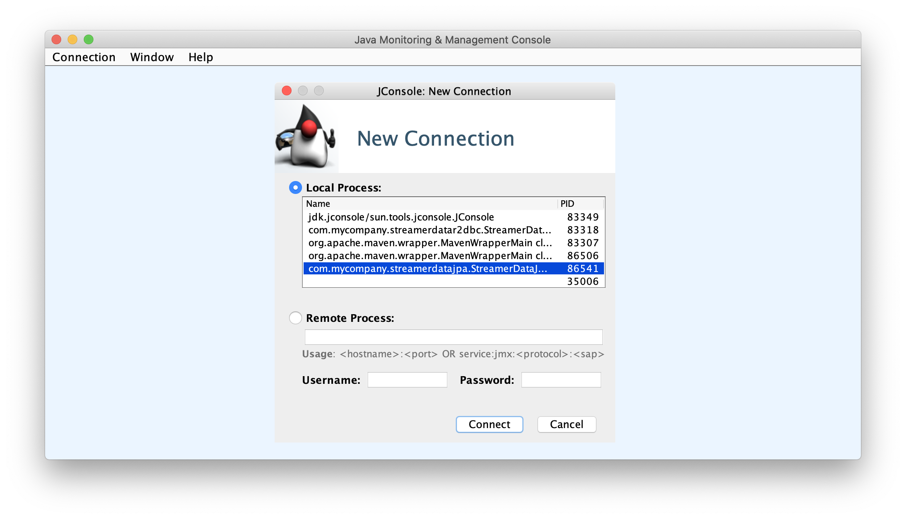
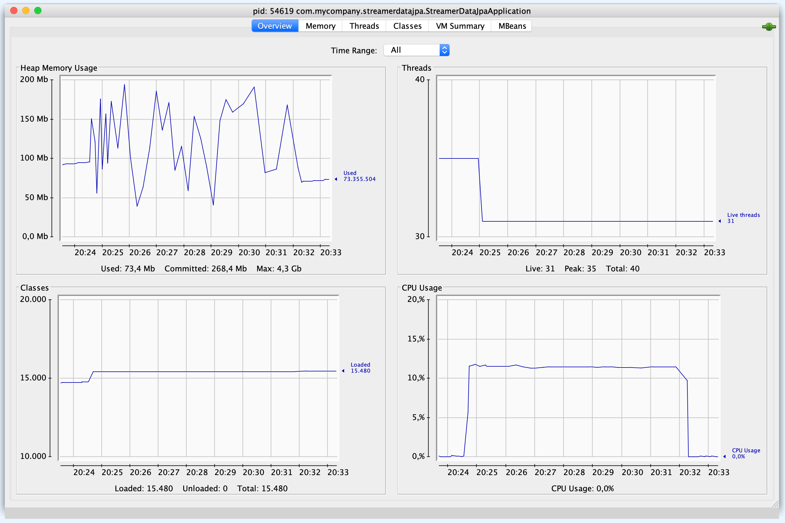
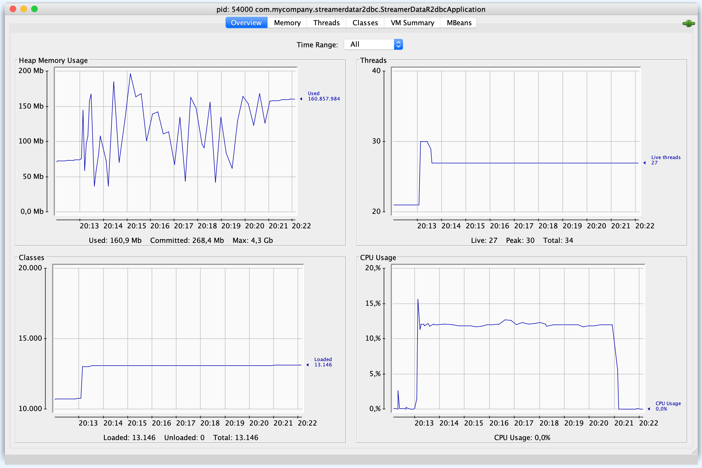

# spring-data-jpa-r2dbc-mysql-stream-million-records

In this project, we will implement two [`Spring Boot`](https://docs.spring.io/spring-boot/docs/current/reference/htmlsingle/) Java Web application called, `streamer-data-jpa` and `streamer-data-r2dbc`. They both will fetch 1 million of customer's data from [`MySQL`](https://www.mysql.com/) and stream them to [`Kafka`](https://kafka.apache.org/). The main goal is to compare the application's performance and resource utilization. 

## Applications

- ### streamer-data-jpa

  `Spring Boot` Web Java application that connects to `MySQL` using [`Spring Data JPA`](https://docs.spring.io/spring-data/jpa/docs/current/reference/html/) and to `Kafka`.

  It provides some endpoints such as:
  - `PATCH api/customers/stream-naive`: to trigger the streaming of customer's data using a naive implementation with `Spring Data JPA`;
  - `PATCH api/customers/stream`: to trigger the streaming of customer's data using a better implementation with `Java 8 Streams` and `Spring Data JPA` as explained in this [article](https://knes1.github.io/blog/2015/2015-10-19-streaming-mysql-results-using-java8-streams-and-spring-data.html).
  - `PATCH api/customers/load?number=x`: to create `x` number of random customers.

- ### streamer-data-r2dbc

  `Spring Boot` Web Java application that connects to `MySQL` using [`Spring Data R2DBC`](https://docs.spring.io/spring-data/r2dbc/docs/current/reference/html/) and to `Kafka`.

  It provides some endpoints such as:
  - `PATCH api/customers/stream`: to trigger the streaming of customer's data;
  - `PATCH api/customers/load?number=x`: to create `x` number of random customers.

## Prerequisites

- [`Java 11+`](https://www.oracle.com/java/technologies/downloads/#java11)
- [`Docker`](https://www.docker.com/)
- [`Docker-Compose`](https://docs.docker.com/compose/install/)

## Start Environment

- Open a terminal and inside `spring-data-jpa-r2dbc-mysql-stream-million-records` root folder run
  ```
  docker-compose up -d
  ```

- Wait for Docker containers to be up and running. To check it, run
  ```
  docker-compose ps
  ```

- Once `MySQL`, `Kafka` and `Zookeeper` are up and running, run the following scripts to initialize `MySQL` database and to create two `Kafka` topics
  ```
  ./init-mysql-db.sh
  ./init-kafka-topics.sh
  ```

## Run applications with Maven

Inside `spring-data-jpa-r2dbc-mysql-stream-million-records`, run the following Maven commands in different terminals

- **streamer-data-jpa**
  ```
  ./mvnw clean spring-boot:run --projects streamer-data-jpa
  ```

- **streamer-data-r2dbc**
  ```
  ./mvnw clean spring-boot:run --projects streamer-data-r2dbc
  ```

### Simulation

- #### JConsole

  We will use [`JConsole`](https://openjdk.java.net/tools/svc/jconsole/) tool to monitor machine resources consumption. In order to run it, open a new terminal and run
  ```
  jconsole
  ```
  
  A window similar to the one below will open

  

  In `JConsole`, we can connect to `streamer-data-jpa` and `streamer-data-r2dbc` applications and check how they are consuming the machine resources.

- #### kafka-console-consumer

  In order to see the messages related to customer's data pushed to `Kafka`, we can use `kafka-console-consumer` tool. For it, open a new terminal and run
  ```
  docker exec -t zookeeper kafka-console-consumer --bootstrap-server kafka:9092 --whitelist 'com.mycompany.streamerdatajpa.customers|com.mycompany.streamerdatar2dbc.customers'
  ```

- #### Streaming customer's data

  In another terminal, call the following `curl` commands to trigger the streaming of customer's data from `MySQL` to `Kafka`. 

  It will take some time to stream all records. Meanwhile, go to `JConsole` and monitor the machine resources utilization.

  At the end of the `curl` command, the total time it took (in seconds) to process will be displayed. 

  - **streamer-data-jpa**

    _Naive implementation_
    ```
    curl -w "Response Time: %{time_total}s" -s -X PATCH localhost:9080/api/customers/stream-naive
    ```
  
    _Better implementation_
    ```
    curl -w "Response Time: %{time_total}s" -s -X PATCH localhost:9080/api/customers/stream
    ```

  - **streamer-data-r2dbc**
    ```
    curl -w "Response Time: %{time_total}s" -s -X PATCH localhost:9081/api/customers/stream
    ```

- #### Sample

  Here is a sample simulation I've got in my machine

  - **streamer-data-jpa**

    _Naive implementation_
    ```
    Response Time: 414.486126s
    ```
    

    _Better implementation_
    ```
    Response Time: 453.692525s
    ```
    

  - **streamer-data-r2dbc**
    ```
    Response Time: 476.951654s
    ```
    

## Useful commands

- **MySQL monitor**

  To check data in `customerdb` database
  ```
  docker exec -it -e MYSQL_PWD="secret" mysql mysql -uroot --database customerdb
  select count(*) from customer;
  ```

  To create a dump from `customer` table in `customerdb` database, make sure you are in `spring-data-jpa-r2dbc-mysql-stream-million-records` root folder and run
  ```
  ./dump-mysql-db.sh
  ```
