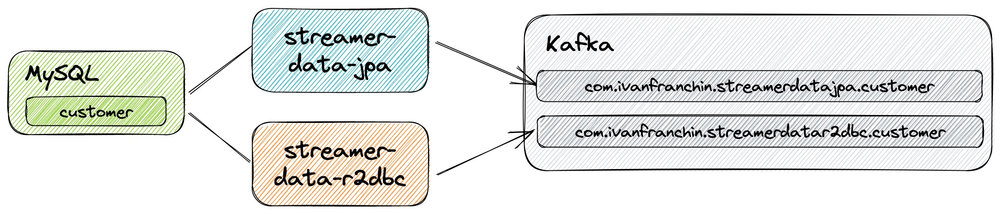
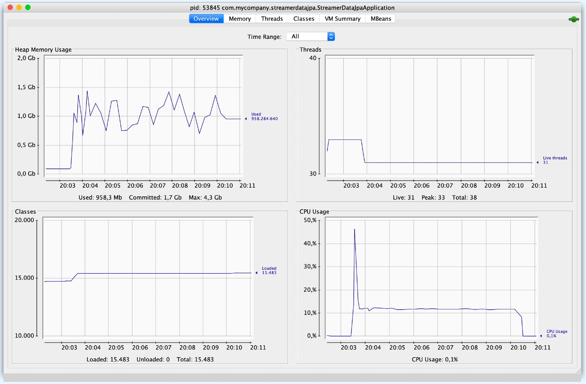
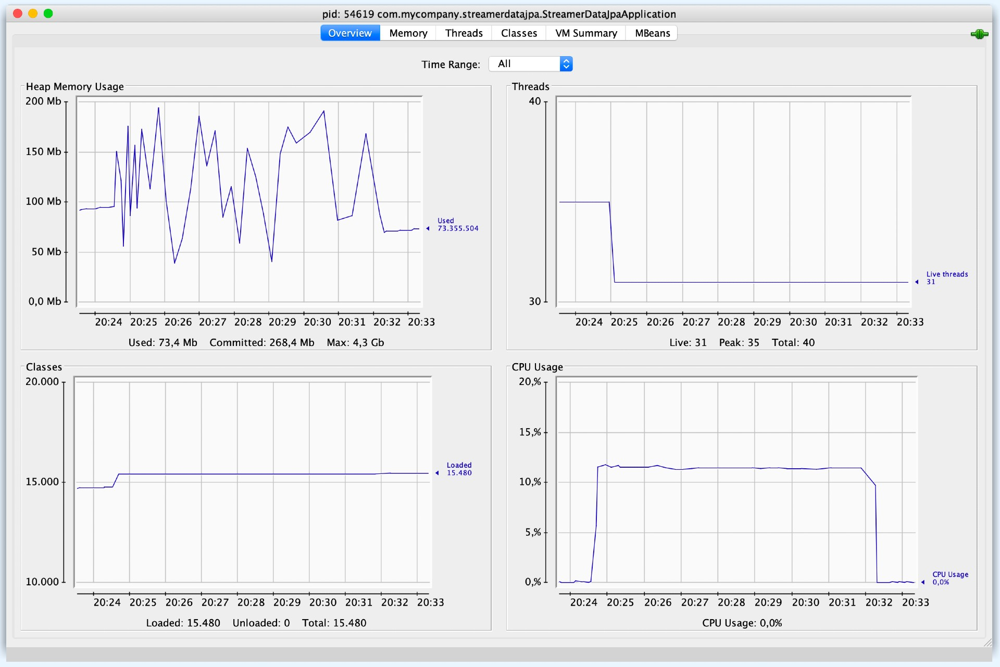
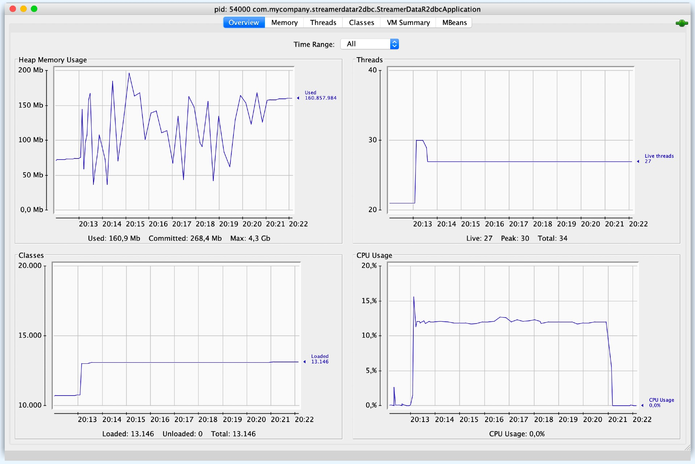

# spring-data-jpa-r2dbc-mysql-stream-million-records

In this project, we will implement two [`Spring Boot`](https://docs.spring.io/spring-boot/docs/current/reference/htmlsingle/) Java Web application called, `streamer-data-jpa` and `streamer-data-r2dbc`. They both will fetch 1 million of customer's data from [`MySQL`](https://www.mysql.com/) and stream them to [`Kafka`](https://kafka.apache.org/). The main goal is to compare the application's performance and resource utilization. 

## Proof-of-Concepts & Articles

On [ivangfr.github.io](https://ivangfr.github.io), I have compiled my Proof-of-Concepts (PoCs) and articles. You can easily search for the technology you are interested in by using the filter. Who knows, perhaps I have already implemented a PoC or written an article about what you are looking for.

## Project Diagram



## Applications

- ### streamer-data-jpa

  `Spring Boot` Web Java application that connects to `MySQL` using [`Spring Data JPA`](https://docs.spring.io/spring-data/jpa/docs/current/reference/html/) and to `Kafka`.

  It provides some endpoints such as:
  - `PATCH api/customers/stream-naive[?limit=x]`: to stream customer records using a naive implementation with `Spring Data JPA`;
  - `PATCH api/customers/stream[?limit=x]`: to stream customer records using a better implementation with `Java 8 Streams` and `Spring Data JPA` as explained in this [article](https://knes1.github.io/blog/2015/2015-10-19-streaming-mysql-results-using-java8-streams-and-spring-data.html).
  - `PATCH api/customers/load?amount=x`: to create a specific amount of random customer records.

- ### streamer-data-r2dbc

  `Spring Boot` Web Java application that connects to `MySQL` using [`Spring Data R2DBC`](https://docs.spring.io/spring-data/r2dbc/docs/current/reference/html/) and to `Kafka`.

  It provides some endpoints such as:
  - `PATCH api/customers/stream[?limit=x]`: to stream customer records;
  - `PATCH api/customers/load?amount=x`: to create a specific amount of random customer records.

## Prerequisites

- [`Java 17+`](https://www.oracle.com/java/technologies/downloads/#java17)
- [`Docker`](https://www.docker.com/)

## Start Environment

- Open a terminal and inside `spring-data-jpa-r2dbc-mysql-stream-million-records` root folder run
  ```
  docker compose up -d
  ```

- Wait for Docker containers to be up and running. To check it, run
  ```
  docker compose ps
  ```

- Once `MySQL`, `Kafka` and `Zookeeper` are up and running, run the following scripts

  - To create two `Kafka` topics
    ```
    ./init-kafka-topics.sh
    ```

  - To initialize `MySQL` database and to create two `Kafka` topics
    ```
    ./init-mysql-db.sh 1M
    ```
    > **Note**: we can provide the following load amount values: 0, 100k, 200k, 500k or 1M

## Run applications with Maven

Inside `spring-data-jpa-r2dbc-mysql-stream-million-records`, run the following Maven commands in different terminals

- **streamer-data-jpa**
  ```
  ./mvnw clean spring-boot:run --projects streamer-data-jpa
  ```

- **streamer-data-r2dbc**
  ```
  ./mvnw clean spring-boot:run --projects streamer-data-r2dbc
  ```

## Run applications as Docker containers

- ### Build Docker Images

  - In a terminal, make sure you are in `spring-data-jpa-r2dbc-mysql-stream-million-records` root folder
  - Run the following script to build the Docker images
    - JVM
      ```
      ./docker-build.sh
      ```
    - Native (not implemented yet)
      ```
      ./docker-build.sh native
      ```

- ### Environment Variables

  - **streamer-data-jpa**

    | Environment Variable | Description                                                             |
    |----------------------|-------------------------------------------------------------------------|
    | `MYSQL_HOST`         | Specify host of the `MySQL` database to use (default `localhost`)       |
    | `MYSQL_PORT`         | Specify port of the `MySQL` database to use (default `3306`)            |
    | `KAFKA_HOST`         | Specify host of the `Kafka` message broker to use (default `localhost`) |
    | `KAFKA_PORT`         | Specify port of the `Kafka` message broker to use (default `29092`)     |

  - **streamer-data-r2dbc**

    | Environment Variable | Description                                                             |
    |----------------------|-------------------------------------------------------------------------|
    | `MYSQL_HOST`         | Specify host of the `MySQL` database to use (default `localhost`)       |
    | `MYSQL_PORT`         | Specify port of the `MySQL` database to use (default `3306`)            |
    | `KAFKA_HOST`         | Specify host of the `Kafka` message broker to use (default `localhost`) |
    | `KAFKA_PORT`         | Specify port of the `Kafka` message broker to use (default `29092`)     |

- ### Start Docker Containers

  Run the following `docker run` commands in different terminals

  - **streamer-data-jpa**
    ```
    docker run --rm --name streamer-data-jpa -p 9080:9080 \
      -e MYSQL_HOST=mysql -e KAFKA_HOST=kafka -e KAFKA_PORT=9092 \
      --network spring-data-jpa-r2dbc-mysql-stream-million-records_default \
      ivanfranchin/streamer-data-jpa:1.0.0
    ```

  - **streamer-data-r2dbc**
    ```
    docker run --rm --name streamer-data-r2dbc -p 9081:9081 \
      -e MYSQL_HOST=mysql -e KAFKA_HOST=kafka -e KAFKA_PORT=9092 \
      --network spring-data-jpa-r2dbc-mysql-stream-million-records_default \
      ivanfranchin/streamer-data-r2dbc:1.0.0
    ```

## Simulation with 1 million customer records

Previously, during [Start Environment](#start-environment) step, we initialized MySQL with 1 million customer records.

### Resource Consumption Monitoring Tool

- **Running applications with Maven**

  We will use [`JConsole`](https://openjdk.java.net/tools/svc/jconsole/) tool. In order to run it, open a new terminal and run
  ```
  jconsole
  ```

- **Running applications as Docker containers**

  We will use [`cAdvisor`](https://github.com/google/cadvisor) tool. In a browser, access
  - to explore the running containers: http://localhost:8080/docker/
  - to go directly to a specific container:
    - **streamer-data-jpa**: http://localhost:8080/docker/streamer-data-jpa
    - **streamer-data-r2dbc**: http://localhost:8080/docker/streamer-data-r2dbc

### Streaming customer records

In another terminal, call the following `curl` commands to trigger the streaming of customer records from `MySQL` to `Kafka`. At the end of the `curl` command, the total time it took (in seconds) to process will be displayed.

We can monitor the amount of messages and the messages themselves been streamed using [Kafdrop – Kafka Web UI](https://github.com/obsidiandynamics/kafdrop) at http://localhost:9000

- **streamer-data-jpa**

  _Naive implementation_
  ```
  curl -w "Response Time: %{time_total}s" -s -X PATCH localhost:9080/api/customers/stream-naive
  ```
  
  _Better implementation_
  ```
  curl -w "Response Time: %{time_total}s" -s -X PATCH localhost:9080/api/customers/stream
  ```

- **streamer-data-r2dbc**
  ```
  curl -w "Response Time: %{time_total}s" -s -X PATCH localhost:9081/api/customers/stream
  ```

### Sample 

A simulation sample running the applications with Maven and using `JConsole` tool

- **streamer-data-jpa**

  _Naive implementation_
  ```
  Response Time: 414.486126s
  ```
  

  _Better implementation_
  ```
  Response Time: 453.692525s
  ```
  

- **streamer-data-r2dbc**
  ```
  Response Time: 476.951654s
  ```
  

## Useful commands & links

- **Kafdrop**

  `Kafdrop` can be accessed at http://localhost:9001

- **MySQL monitor**

  To check data in `customerdb` database
  ```
  docker exec -it -e MYSQL_PWD=secret mysql mysql -uroot --database customerdb
  SELECT count(*) FROM customer;
  ```

  To create a dump from `customer` table in `customerdb` database, make sure you are in `spring-data-jpa-r2dbc-mysql-stream-million-records` root folder and run
  ```
  ./dump-mysql-db.sh
  ```

## Shutdown

- To stop `streamer-data-jpa` and `streamer-data-r2dbc`, go to the terminals were they are running and press `Ctrl+C`
- To stop and remove docker compose containers, network and volumes, go to a terminal and, inside `spring-data-jpa-r2dbc-mysql-stream-million-records` root folder, run the command below
  ```
  docker compose down -v
  ```

## Cleanup

To remove all Docker images created by this project, go to a terminal and, inside `spring-data-jpa-r2dbc-mysql-stream-million-records` root folder, run the following script
```
./remove-docker-images.sh
```
